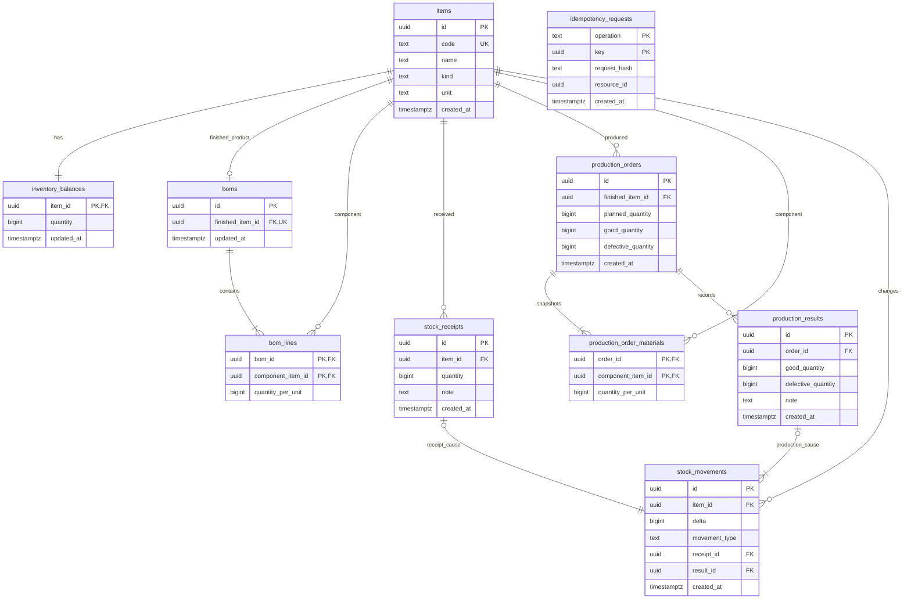

# v1 실제 데이터 모델

> 이 그림은 구현된 v1 모델과 의미를 보존한다. v2 전체 구현은 진행 중이며 목표 모델은 [SSOT](SSOT.md)와 [전환 계획](FACTORY-PLAN.md)을 따른다. 이 그림은 병렬 작성 중인 v2 DDL의 구현·적용·검증 증거가 아니다.

원본 DDL은 `apps/api/db/migrations/00001_initial.sql`이다. 이 문서는 관계를 설명하며 마이그레이션을 대체하지 않는다.
모든 업무 리소스 ID는 UUID, 수량은 BIGINT, 시간은 TIMESTAMPTZ다. API는 UTC를 반환하고 UI는 Asia/Seoul로 표시한다.

그림의 필수 하위 행 수에는 서비스가 보장하는 업무 관계가 포함된다. 외래 키만으로 부모마다 하위 행이 반드시 존재하는 것까지 보장하지는 않는다.

## 제약과 책임

| 대상 | 보장 내용 |
| --- | --- |
| 품목 | 코드의 고유성·형식, 종류, 이름/단위 길이. 생성 시 재고 0의 행을 같은 트랜잭션에서 생성 |
| BOM | 완제품당 헤더 1개, 부품 중복 금지, 단위 소요량 1~1,000,000. 품목 종류와 최소 1개 행은 서비스에서 검증 |
| 현재고 | 0~1,000,000,000,000 CHECK 제약. 잔액 갱신과 변동 이력을 항상 동시 저장 |
| 생산 지시 | 계획 1~1,000,000, 양품·불량 누계는 음수 불가, 누계 합계는 계획 이하 |
| 생산 실적 | 양품·불량 0~1,000,000, 처리 합계 1 이상. 지시 잔여량은 행 잠금 후 확인 |
| 재고 변동 | 0수량 금지. 수동 입고는 receipt_id만, 생산은 result_id만 지정. 종류와 수량 부호를 CHECK로 제한 |
| 중복 처리 | 입고 ID마다 변동 1개, 실적 ID와 품목 ID 조합마다 변동 1개. 작업 종류와 요청 키 조합은 고유 |

## 동시성 및 이력

`idempotency_requests.resource_id`는 작업 종류에 따라 입고·지시·실적을 가리키므로 다형 외래 키를 흉내 내지 않는다. 요청 키 확보와 해당 리소스 생성은 같은 트랜잭션에서 수행한다. 실패한 요청 키는 저장되지 않는다.

현재 BOM은 `boms`/`bom_lines`, 과거 지시의 확정 기준은 `production_order_materials`다. BOM 변경이 과거 지시를 변경하지 않는다. 지시 상태와 잔여 수량은 저장하지 않고 계획·누계에서 계산한다.

`stock_movements`는 `manual_receipt`, `production_consumption`, `production_receipt`만 허용한다. 전량 불량은 자재 소비 이력만 생성하고 0수량 완제품 입고를 만들지 않는다.

품목별 이력 합계=현재고, 지시별 실적 합계=누계는 여러 행에 걸친 불변 조건이다. 서비스의 원자적 트랜잭션과 통합 테스트로 보호하며 `pnpm check:invariants`로 별도의 실제 DB 대조를 수행한다.

## v2 전환 시 모델 증거

v2는 별도 schema·DB 역할·API 의미를 사용하고 사용자/역할/로그인 세션, 승인 개정, 작업 세션, 위치/로트/지시별 잔액, 전표·품질 상태·역분개·감사를 연결해야 한다. 위 v1 테이블에 로트·검사·작성자가 이미 존재한다고 가정하지 않는다.
실제 v2 마이그레이션·외래 키·CHECK·고유 제약과 서비스의 다행 불변 조건을 통합 담당자가 대조한 뒤 별도 v2 설명을 이 문서에 추가한다. [SSOT 수량 한도](SSOT.md#31-수량-한도와-계산-기본값), 계정별 요청 키 소유권, v1/v2 DB 역할의 접근 격리는 실제 검증이 필요하다. 문서 분리만으로 데이터 격리가 구현된 것은 아니다.
